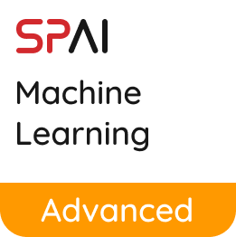

  

# SPAI's Advanced Machine Learning Workshop 2021

The page will be updated once the workshop is completed.
Do keep an eye out on our Social Media Handles at [@spai.sp](https://www.instagram.com/spai.sp/).

## Bootcamp Curriculum
| Day | Brief Description |
| --- | --- |
| Day 0 | Beginner Machine Learning Bootcamp Recap |
| Day 1 | Pipelines and Advance Preprocessing |
| Day 2 | Bias and Variance |
| Day 3 | Model Selection & Hyperparameter Tuning |
